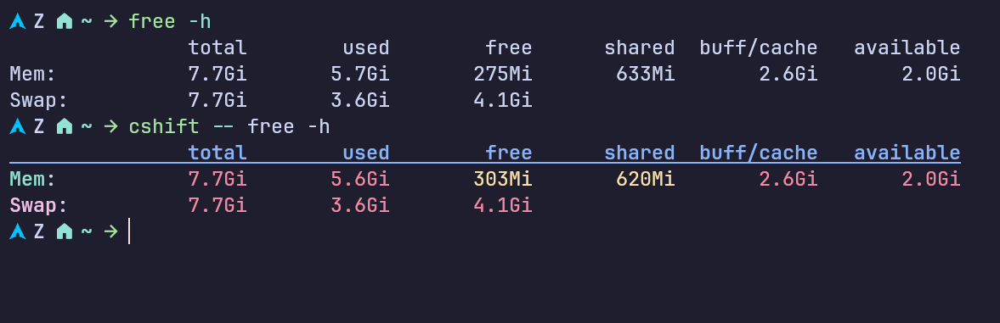

# Colorize

A output colorizer for your favorite commands.



## Installation

To install Colorize, run the following script:

```sh
curl -s https://raw.githubusercontent.com/Nadim147c/colorize/main/scripts/install.gh-release.sh | sh
```

## Usage

Simply run your favorite commands through colorize to see the output in enhanced colors. For example:

```bash
colorize -- <your-command>
```

List of available command can be found in [config.toml](./config.toml) file.

## Contribution

If your favorite command is not supported yet, feel free to create an [issue](https://github.com/Nadim147c/colorize/issues).
If you want to contribute your rules for any specific command. Then here's how:

### Contribution Guide: Creating Custom Rules

To create your own colorization rules, you’ll need a basic understanding of regular expressions (regex). Let’s walk through an example where you want to create a colorization rule for the `du` command (note: a rule for `du` already exists).

1. First, add an entry in the [config.toml](./config.toml) file like this:

   ```toml
   [du]
   regexp = '^([/\w\.]+\/)?du\b'
   file = 'du.toml'
   ```

   Here's how it works: `colorize` first checks if the command name matches `du` exactly, then loads the corresponding `du.toml` file to apply the colorization rules. If it doesn’t find a direct match, it uses the specified `regexp` to check the command. This means running `colorize -- /usr/bin/du` will also work as expected.

2. Next, create a TOML file in the [rules](./rules/) directory. The file name should match what you specified in [config.toml](./config.toml), in this case, `du.toml`.

3. For schema validation, add the following line to the top of your TOML file:

   ```toml
   "$schema" = '../rule.schema.json'
   ```

   This ensures that the rules you define will be validated according to the schema, providing helpful feedback as you work on them.

4. **How do rules work?**

   Each rule is defined as an array block within the TOML file. Here's an example of a rule for highlighting totals:

   ```toml
   [[rules]] # Total
   regexp = '(.*)\s+(total)$'
   colors = 'bold yellow bgblue'
   ```

   In this example:

   - `regexp` is the regular expression that matches the text you want to style.
   - `colors` specifies the styles to apply. You can use multiple styles by separating them with spaces (e.g., `bold yellow bgblue` applies bold yellow text with a blue background).

   If you want to apply different styles to different capture groups in your regex, separate the styles with a comma (`,`).

   ```toml
   [[rules]] # Destination
   regexp = '^\[download\] (Destination): (.*)'
   colors = 'yellow,magenta'
   ```

   In this rule:

   - The word "Destination" is colored yellow.
   - The second group (anything that comes after "Destination") is colored magenta.

By following these steps, you can easily create new colorization rules for any command!

## LICENSE & CREDIT

colorize is licensed under the [GNU-GPL-3](./LICENSE).
Most of its features have been shamelessly stolen from [garabik/grc](https://github.com/garabik/grc).
